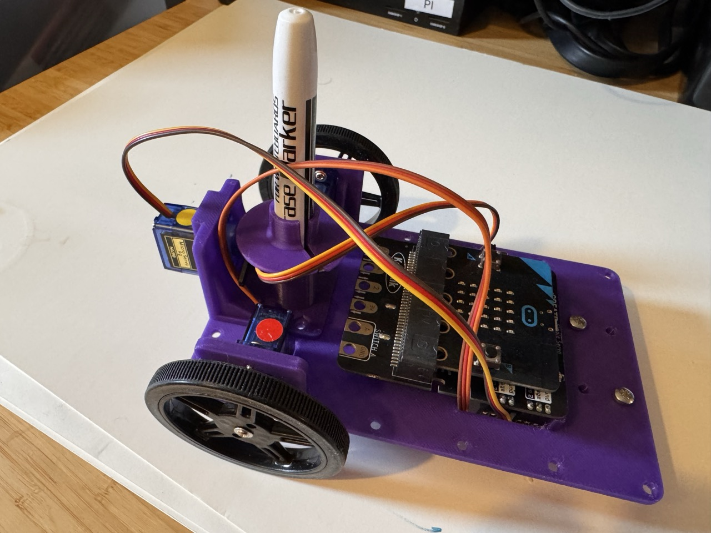

## CuttleBot Drawing Robot ##

CuttleBot is a simple drawing robot for the BBC Micro:bit.

**1. The Cuttlebot**

**2. 3D-printed Parts**

**Other Parts**

1 x Kitronik CREATE servo board (£9.42)
https://kitronik.co.uk/products/5673-kitronik-simple-servo-control-board-for-bbc-micro-bit

2 x 360-degree servos (approx. £2 each)

1 x 180-degree servo (approx. £2)

**Castor Option 1**

1 x Caster

**Castor Option 2**

1 x Ball bearing

**Wheels Option 1**

2 x 3D-printed wheels and o-rings

**Wheels Option 2**

2 x Servo wheels (£1.20 each)
https://shop.pimoroni.com/products/wheel-for-continuous-rotation-servo?variant=53509783060859
