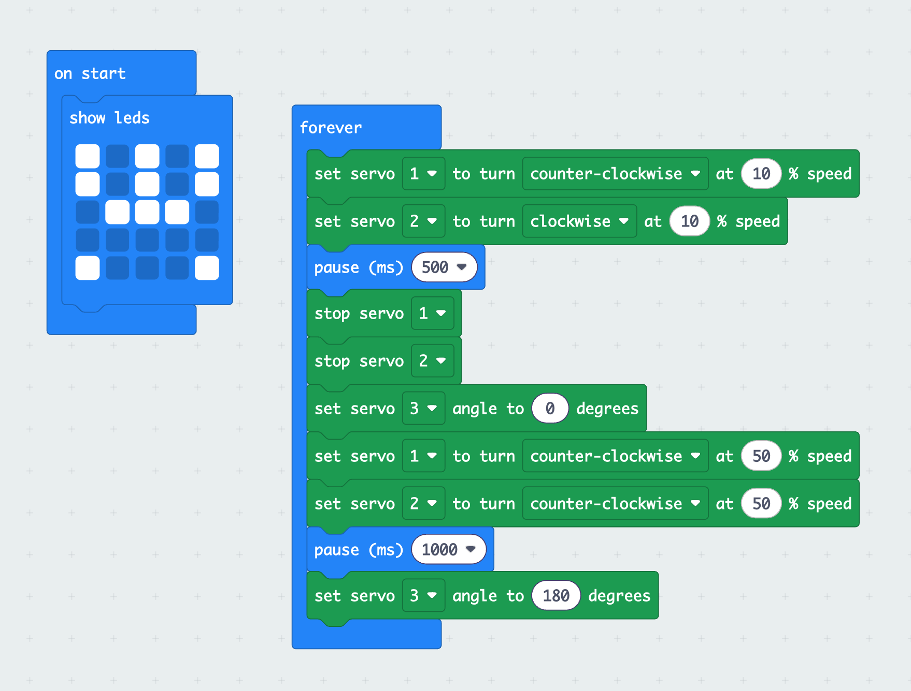

# Cuttlebot Drawing Robot #

Beta Release 13nth September 2026

Https://www.interactdigitalarts.uk/projects/cuttlebot

This early release includes everything you need to build your own **Cuttlebot**, **but it is currently better suited for people with some maker experience.** As the project develops, we will provide much more detailed build instructions and videos.

Cuttlebot is a highly customisable drawing robot for the BBC Micro:bit. It aims to be low-cost, flexible and easy to build. It has a 3D-printed body and uses easy-to-obtain components, with the goal of producing a kit of parts that costs around £15, excluding the Micro:bit itself. For now, you will need to source the parts yourself. If you are already a maker, you may already have many of them.

## **1. The Cuttlebot**

## **2. 3D-printed Parts**

- Base - Base.stl
- Pen tower - Tower.stl
- Casters (two options) - Caster-1.stl, Caster-2.stl
- Wheels (optional) - Wheel.stl
- Pen collar (customisable) - Collar.stl

## **3. Other Parts**

1 x Kitronik CREATE servo board (£9.42)

https://kitronik.co.uk/products/5673-kitronik-simple-servo-control-board-for-bbc-micro-bit

2 x 360-degree 9g servos (approx. £2 each)

Not all servos are the same. Some lack power and others don;t like to run at slower speeds. We currently use / "SG92R 9G Micro Servo Analog Servo Motor Kit, Mini Servos 360 Degree Continuous Rotation" from Amazon (packs of 10). https://www.amazon.co.uk/dp/B0DXVF4TVQ

1 x 180-degree servo (approx. £2)

As above. We use "SG92R 9g Micro Analog Servo, Metal Gear, 1.8kg·cm Torque & 0.08s/60°, 180° Control Angle". https://www.amazon.co.uk/dp/B0DXQ74VV6

### **Castor Option 1**

1 x Off-the-shelf Castor

Screw this on to the 3D-printed riser. https://www.amazon.co.uk/Hobby-Components-Ltd-Omni-Directional-Castor/dp/B01LYHWB34

### **Castor Option 2**

1 x Ball Bearing

Push this in to the 3D-printed holder.

### **Wheels Option 1**

2 x 3D-printed wheels and 56mm O-ring

https://www.amazon.co.uk/TA-VIGOR-Nitrile-Washers-Automotive-Plumbing/dp/B0CRZ5TW1G/ref=sr_1_1

### **Wheels Option 2**

2 x Servo wheels (£1.20 each)

https://shop.pimoroni.com/products/wheel-for-continuous-rotation-servo?variant=53509783060859

### Pens and Pen Collars

The 3D-printed pen collar is designed for use with Sharpie pens and pens of the same dimensions, such as Volcanics Whiteboard Pens Fine Tip Dry Wipe Pens https://www.amazon.co.uk/Erase-Markers-Odor-Whiteboard-Colors/dp/B0854KLTZ1

## **4. Micro:bit Code**

The **Cuttlebot** currently uses the Micro:bit MakeCode environment for software development. It uses the standard **servo extension** to control the servo motors. An example program is shown below.  To run the Cuttlebot forward. Run it fairly slowly if you want more control over your drawings. Set servo 1 to counter-clockwise, and servo 2 to clockwise. To drop the pen, set servo 1 to 0 degrees; to lift it, set it to 180 degrees. To spin on the spot, set servo 1 and 2 to counter-clockwise, or vice versa.

[Download the .hex file](microbit-Cuttlebot.hex) and import it into MakeCode.

## 5. Keep in Touch

We're very excited to see how Cuttlebot develops. We want it to be the focus of a creative community of people interested in digital art and drawing machines. If you would like to join us on this journey, please get in touch, and we will add you to the Cuttlebot mailing list. Send a message to Sean Clark at [seanc@interactdigitalarts.uk](mailto:seanc@interactdigitalarts.uk).

## Acknowledgements

Various other online projects have fed into this one. We will share all links in the first full release.

